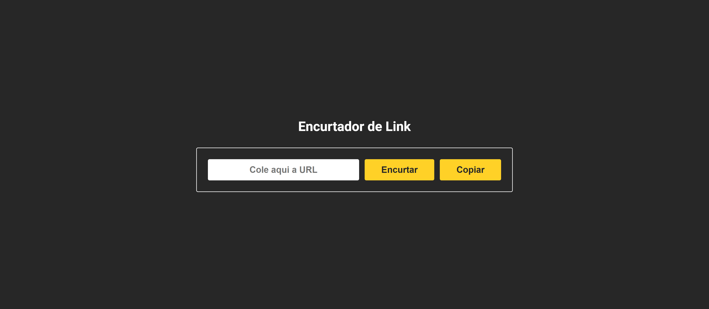

<h1 align="center">
  Encurtador de Link
</h1>

  

## Projeto - Encurtador de Link

Esse projeto foi criado para proporcionar aos usuários uma experiência agradável ao encurtar links HTTPS por meio de uma API. Ele possui um design atrativo, é bem estruturado e responsivo em vários dispositivos.

Tecnologias Utilizadas:
* [HTML (Linguagem de marcação):](https://www.w3schools.com/html/html_intro.asp) Utilizado para estruturar e definir o conteúdo da página, incluindo cabeçalhos, parágrafos, listas e imagens.
* [CSS (Folha de estilos em cascata):](https://www.w3schools.com/css/css_intro.asp) Utilizado para estilizar os elementos da página, definindo cores, tamanhos, fontes e layout, proporcionando uma aparência visualmente atraente.
* [JavaScript:](https://developer.mozilla.org/pt-BR/docs/Web/JavaScript) Utilizado para adicionar interatividade à página, permitindo que o usuário selecione personagens e exiba informações dinamicamente.
* [TinyJPG](https://tinyjpg.com/) e [TinyPNG:](https://tinypng.com/) O site utilizado é uma ferramenta online que comprime imagens JPEG e PNG sem perder muita qualidade. Ele reduz o tamanho dos arquivos de imagem usando algoritmos eficientes de compressão.
* [Google Fonts:](https://fonts.google.com/specimen/Heebo) Utilizado para acessar e aplicar fontes personalizadas aos textos da página, melhorando a estilização e a legibilidade.

Créditos:
* Criado por minha autoria | [José Carlos • jcddsj01](https://github.com/jcddsj01)

Implantação do Projeto no Vercel: [Explore o projeto clicando aqui.](https://encurtador-link.vercel.app/)

---

## Project - Link shortener

This project was created to provide users with a pleasant experience when shortening HTTPS links via an API. It has an attractive design, is well structured and responsive on various devices.

Technologies used:
* [HTML (HyperText Markup Language):](https://www.w3schools.com/html/html_intro.asp) Used to structure and define page content, including headings, paragraphs, lists and images.
* [CSS (Cascading Style Sheets):](https://www.w3schools.com/css/css_intro.asp) Used to style the elements of the page, defining colors, sizes, fonts and layout, providing a visually appealing appearance.
* [JavaScript:](https://developer.mozilla.org/pt-BR/docs/Web/JavaScript) Used to add interactivity to the page, allowing the user to select characters and display information dynamically.
* [TinyJPG](https://tinyjpg.com/) e [TinyPNG:](https://tinypng.com/) The website used is an online tool that compresses JPEG and PNG images without losing much quality. It reduces the size of image files using efficient compression algorithms.
* [Google Fonts:](https://fonts.google.com/specimen/Heebo) Used to access and apply custom fonts to page texts, improving stylization and readability.

Credits:
* Created by me | [José Carlos • jcddsj01](https://github.com/jcddsj01)

Project deployment on Vercel: [Explore the project by clicking here.](https://encurtador-link.vercel.app/)
